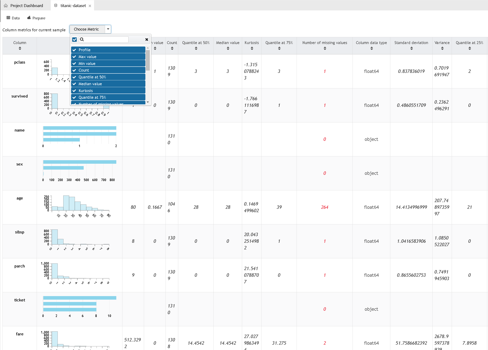

# Titanic ML - Classification

This example is based on actual data from the Titanic catastrophe. In this example a classification algorithm is built that is able to predict, if a fictual person would have survived the Titanic accident.

## Prerequisits
* Create an Azure Machine Learning Experimentation account.
* Azure Machine Learning Workbench installed

You can follow the instructions in the [Install and create Quickstart](https://docs.microsoft.com/en-us/azure/machine-learning/preview/quickstart-installation) article to install the Azure Machine Learning Workbench application.

## Setup
1. Start of by cloning the [repository](https://github.com/starlord-daniel/AML-Labs) on your local machine.
2. The files needed for the experiment are located under *1-AML-Titanic*
3. Open *Azure Machine Learning Workbench* and add the project to your workspace
4. Fill in the **Project name** and **Project directory** boxes. **Project description** is optional but helpful. Leave the Visualstudio.com GIT Repository URL box blank for now and choose a workspace (created in [installation guide](https://docs.microsoft.com/en-us/azure/machine-learning/preview/quickstart-installation)).

After setting up your project you should see the dashboard of the project.

## Data Exploration
In the *titanic.csv* file you can find the data used by the model. Before we get started with preparing the data for the experiment let's have a quick look at what the data is about.

| Variable | Definition | Key |
| ------------- |-------------| -----|
| survival | Survival | 0 = no, 1 = yes |
| pclass | Ticket class |   1 = 1st, 2 = 2nd, 3 = 3rd |
| sex | Sex ||
| Age | Age in years ||
| sibsp | # of siblings / spouses aboard the Titanic ||
| parch | # of parents / children aboard the Titanic ||
| ticket | Ticket number ||
| fare | Passenger Fare ||
| cabin | Cabin number ||
| embarked | Port of Embarkation | C = Cherbourg, Q = Queenstown, S = Southampton |
| boat | # of life boat if survived ||
| body | # of body if dead ||

To get to know your data even better and explore certain statistical figures click on *Metrics* in the top bar of the data section:

## Data Preparation
